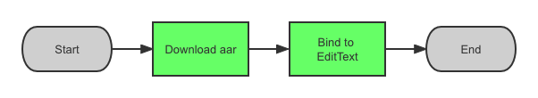
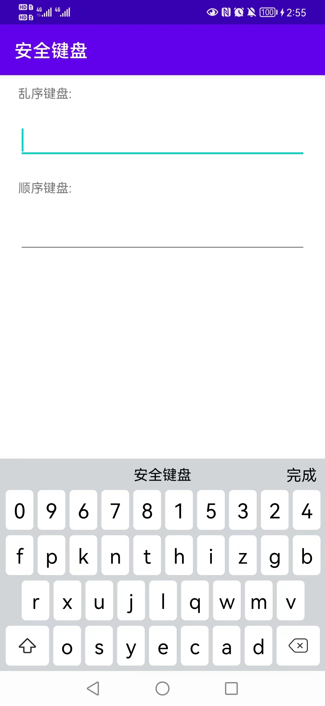
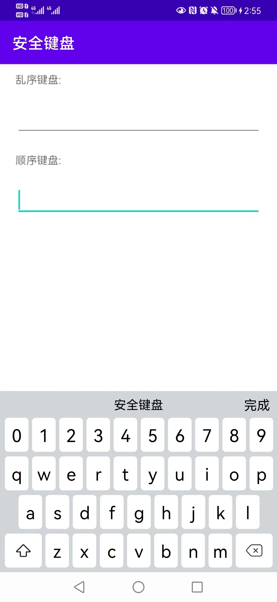

### [README of Chinese](README_CN.md)

# Secure Keyboard
[](https://bintray.com/geyifeng/maven/immersionbar) [](https://github.com/gyf-dev)

## About
This library provides a secure keyboard.

Account number, password, SMS verification code and other information related to user privacy and property security are entered into the application through the keyboard.
Some criminals can steal the above information by hooking system keyboard and third-party keyboards, intercepting the click positions of keys on the screen, etc,
threatening the privacy and property security of users.

To solve this problem, we provide a secure keyboard based on the KeyboardView and Keyboard provided by Android.
Our secure keyboard is bounded to EditText through java codes, and is displayed and hidden according to the focus state of EditText.
When EditText gets the focus, the security keyboard will be pop up through PopupWindow.

Secure keyboard provide numbers and upper or lower case letter as inputs.
The keys array will be encrypted with AES to avoid dumping memory from attacker to get the keys array.
We also provide shuffle keys, to avoid listening click positions from attacker to get the inputs.
User can customize the title and done button text.

## Effect Picture



## Download the demo
#### [Click me to Download the demo](./output/demo.apk)
#### [Click me to Download the aar](./output/securekeyboard-release.aar)

## Release notes
#### [Click me to view the release notes](./wiki/note.md)


## Documentation

### 1.Basic usage
   ```kotlin
    fun bindSecureEditText(
        view: EditText,
        shuffle: Boolean?,
        title: String?,
        done: String?
    );
   ```

    shuffle: shuffle the keyboard keys
    title: keyboard title, default is "Secure Keyboard"
    done: keyboard done text, default is "Done"

    usage:Bind EditText in Activity using SecureKeyboardManager
   ```xml
    <EditText
        android:id="@+id/et_shuffle"
        android:layout_width="match_parent"
        android:layout_height="wrap_content" />
   ```
   ```kotlin
    import com.hcxc.securekeyboard.SecureKeyboardManager
    SecureKeyboardManager.bindSecureEditText(findViewById(R.id.et_shuffle), true, "title", "done")
   ```
    
### 2.Special instructions（Reference the modified  and the third-party library description）
   ```kotlin
    import android.android.keyboard.Keyboard
    import android.android.keyboard.KeyboardView
   ```

    We followed Android's keyboard and changed them into kotlin format.
